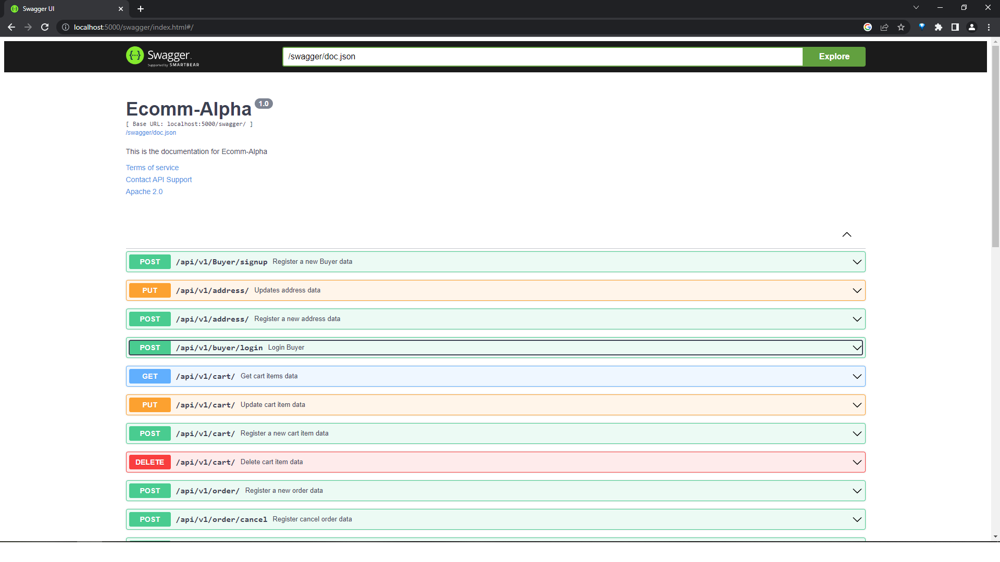
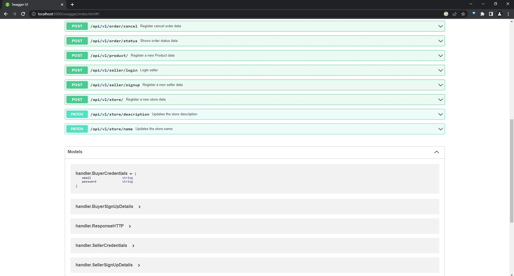
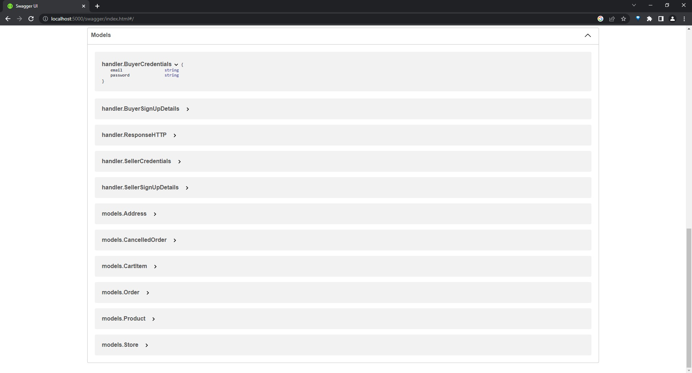

# ecomm-alpha
## To run the project use following steps
- create database first in postgres, data for running tests are also required.
- uuid-ossp extension for postgres require. run on psql --> CREATE EXTENSION "uuid-ossp"; 
- create .env file in root directory of the project
- add below lines in .env file
```
DB_HOST=localhost
DB_PORT=5432
DB_USER=postgres
DB_PASSWORD=123456
DB_NAME=ecomm_alpha
SECRET=asd
```
- run command: go run main.go

## To run tests use following steps
- for available tests, run commands : \
  
  go test .\tests\sellertests\ -v \
  go test .\tests\addresstests\ -v \
  go test .\tests\storetests\ -v \
  go test .\tests\producttests\ -v  
  go test .\tests\buyertests\ -v  
  go test .\tests\carttests\ -v  
  go test .\tests\ordertests\ -v 


## swagger docs -> http://localhost:5000/swagger/


